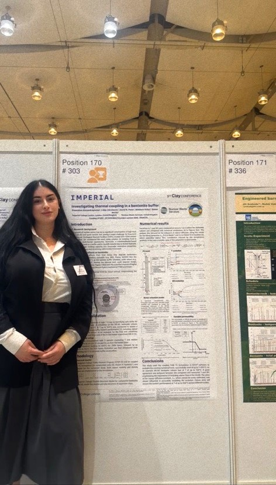

# 👩‍🔬 Stamatina Alexandropoulou (mati12-boop)

  

✨ *Nuclear physicist & engineer | Advancing computational modelling, Python/C++, Monte Carlo simulations (GEANT4, FLUKA), radiation detection and AI/ML for safe and sustainable nuclear technologies.*

---

## 👋 About Me

I am a **PhD Candidate** in the EPSRC Nuclear Energy Futures CDT at Imperial College London, specialising in **thermo-hydro-mechanical (THM) modelling of bentonite barriers** for the geological disposal of radioactive waste. My research develops and validates advanced mathematical and computational models to describe coupled processes in nuclear systems, supporting the safe and sustainable management of radioactive waste.

Previously, I completed an **MSc of Science by Research in Nuclear Physics** at the University of York as a **Marie Skłodowska-Curie Fellow (IAEA, 2020/2021)**, where I investigated nuclear structure and mass formulas for a deeper understanding of fundamental interactions.

---

## 🔑 Skills & Expertise

- **Numerical simulations & modelling:** THM coupled processes, nuclear systems  
- **Programming:** Python, C++  
- **Monte Carlo simulations:** Geant4, FLUKA (particle transport, radiation physics)  
- **Statistical & mathematical methods:** Linear regression, uncertainty analysis, optimisation techniques  
- **Reactor & particle physics**  
- **Radiation detection & spectroscopy**  
- **AI/ML applications:** Exploring machine learning in nuclear science and engineering  

---

## 🌍 Fellowships & Recognition

- **PhD Studentship** – EPSRC Nuclear Energy Futures CDT, Imperial College London & Nuclear Waste Services, UK  
- **IAEA Marie Skłodowska-Curie Fellowship (2020/2021)** – MSc of Science by Research in Nuclear Physics, University of York, UK  
- **Poster Prize** – Nuclear Waste Services Research Support Office Conference (2024)  
- **IKY National Scholarship** – Undergraduate research internship, Environmental Radioactivity Laboratory, NCSR ‘Demokritos’, Greece  
- **Erasmus+ Programme Scholarship** – Research internship, Experimental Nuclear Physics Group, University of Surrey, UK  

---

## 📚 Publications

Find my publications on:  

  
  
  

---

## 🔗 Connect with Me

  

---

## ✨ Fun Facts & Passions

- Love exploring how maths and coding describe complex natural systems  
- Passionate about science communication & inspiring more women in STEM  
- Fan of bridging physics and engineering — from nuclear structure to real-world nuclear engineering applications  
- Excited about applying AI/ML to nuclear problems  
- Enjoy solving complex problems in maths and physics, always ready to contribute to new nuclear challenges and push myself scientifically  

---

> *Advancing computational modelling, Python/C++ simulations and AI/ML for safe and sustainable nuclear technologies.*

